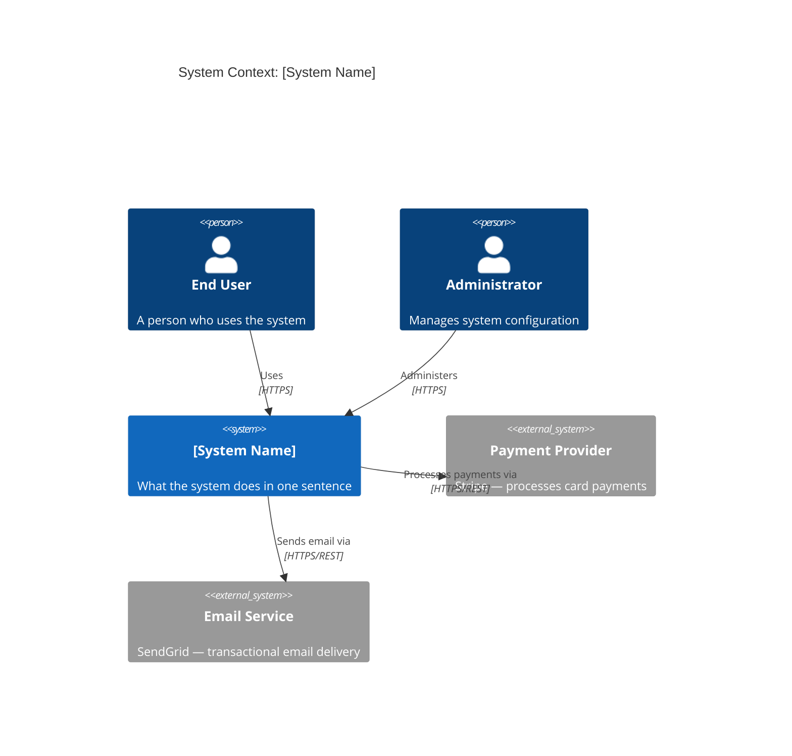
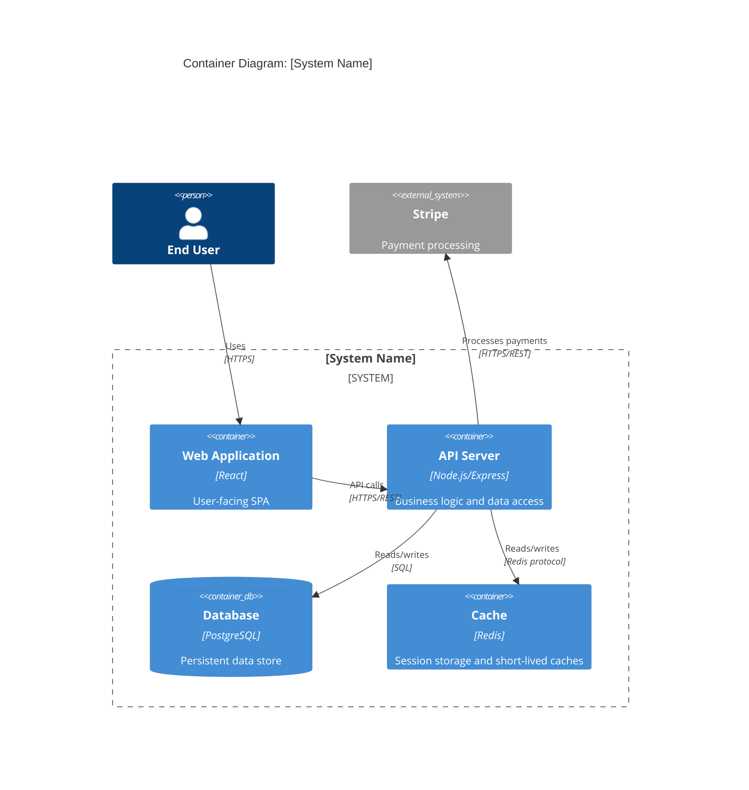
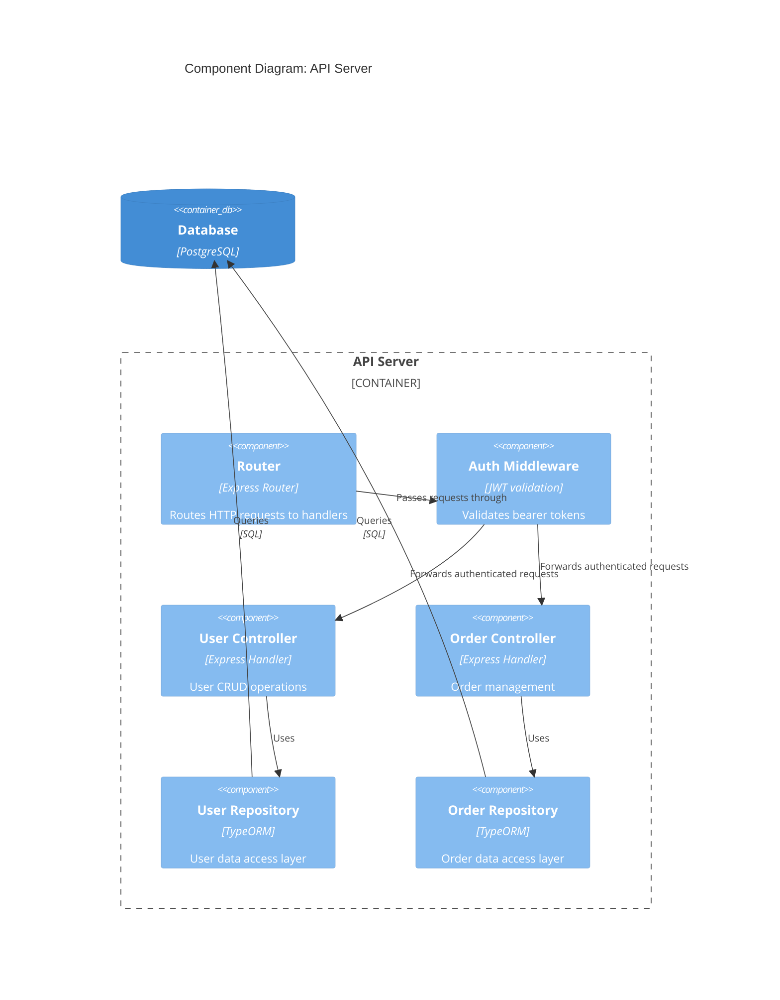

# /arch-c4 — C4 model diagrams

Produces C4 model diagrams using Mermaid. The C4 model gives four levels of progressive zoom into a software system — each serves a different audience and answers a different question.

Read `sdlc-foundation/decision-frameworks.md` (C4 model section) for level definitions.
Read `sdlc-foundation/maturity-tier-detection.md` for which levels to produce.

## The four levels

| Level | Shows | Audience | Question answered |
| :--- | :--- | :--- | :--- |
| 1 — System Context | Your system + its users + external dependencies | Non-technical stakeholders | What is this system and who uses it? |
| 2 — Container | Deployable units inside the system (apps, databases, APIs) | Technical leadership | What are the major deployable pieces? |
| 3 — Component | Major code components inside one container | Developers | How is this container internally structured? |
| 4 — Code | Classes, interfaces, implementation | Rarely needed | Only for complex/critical modules |

**Level 4 is almost never worth the maintenance cost.** The code itself is the source of truth at that level.

## Mermaid output format

### Level 1 — System Context

### Level 2 — Container

### Level 3 — Component (inside one container)

## Procedure

1. **Identify system scope** from prior elicitation/spec output or the user's description
2. **Produce Level 1** — always. Establishes the external boundary unambiguously.
3. **Produce Level 2** at MVP+ tier — identify the major deployable units (web app, API, database, queue, cache, background workers)
4. **Produce Level 3** at scaling tier — for each major container that warrants it; don't Level 3 everything, just the ones with complex internal structure
5. **Add a brief narrative** after each level: what the diagram shows, any architectural patterns visible in it (e.g., "the API is the only component that talks to the database — clean dependency direction"), any concerns

After producing diagrams: recommend `/arch-adr` for any decisions that were implicit in the diagram choices (e.g., which database, which framework).

## Anti-rationalization table
| Common Excuse | Why It's Wrong | What to Do Instead |
|---|---|---|
| "Diagrams get outdated immediately" | Outdated diagrams are still better than no diagrams. The structure rarely changes as fast as the code. | Keep the level 1-2 diagrams current. Update them when architecture changes. |
| "I don't need a diagram, I understand the system" | Understanding in your head doesn't scale to the team. Diagrams communicate structure. | Draw the C4 level 1. If the team can't agree on it, the architecture is unclear. |
| "C4 is overkill for this project" | C4 level 1 is one box with actors. It's never overkill. Level 2-3 is tier-dependent. | Draw the tier-appropriate depth. Hackathon = level 1 only. |
