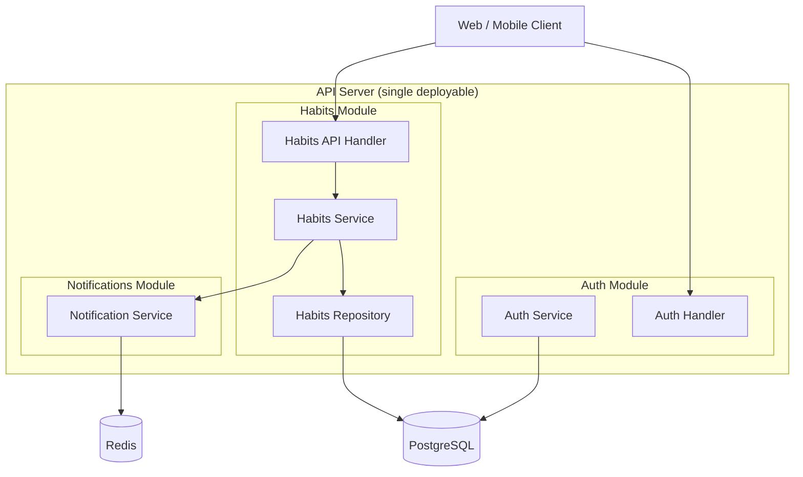

# /arch-components — component decomposition

Decomposes the system into architectural building blocks. Enforces Modular Monolith First by default — always produces the modular monolith version of the architecture, then states the conditions under which extraction to services would be warranted.

## What a component diagram shows
- **Components** — major deployable or logical units (web app, API, worker, database)
- **Interfaces** — what each component provides and requires (REST endpoints, message queues, function contracts)
- **Dependencies** — which components depend on which others, and how (sync/async, which direction)

## Default architectural stance
For any new system: modular monolith with clean module boundaries. Apply Hexagonal Architecture (Ports and Adapters) pattern to enforce separation between domain logic and infrastructure. This gives microservice-like modularity without the Distribution Tax.

Before drawing a distributed architecture, apply the Conway's Law test and Distribution Tax analysis from `sdlc-foundation/decision-frameworks.md`.

## Output format

### Modular monolith version (default)

Accompanied by a module responsibility table:

| Module | Responsibility | Interfaces provided | Dependencies |
|:---|:---|:---|:---|
| Habits | CRUD for habit data, streak calculation | REST: `/habits`, `/habits/{id}` | PostgreSQL, Notifications |
| Auth | User registration, authentication, session | REST: `/auth/login`, `/auth/register` | PostgreSQL |
| Notifications | Schedule and deliver weekly summaries | Internal: `notify(userId, content)` | Redis, Email service |

### Services version (when warranted)
If Conway's Law test passes (multiple independent teams, stable domain boundaries), produce the distributed version with explicit inter-service contracts and flag: which communication pattern (sync REST, async events), which consistency model (strong/eventual), which failure modes emerge.

## Anti-pattern detection
Per `sdlc-foundation/anti-pattern-catalog.md`:
- User describing a monolith across "microservices" → flag Distributed Monolith
- One service with many unrelated domains → flag Monolith-in-Microservices
- Services that all call each other synchronously → flag Chatty Microservices

Recommend next step: `/arch-sequence` for the 2-3 most critical interaction flows.
