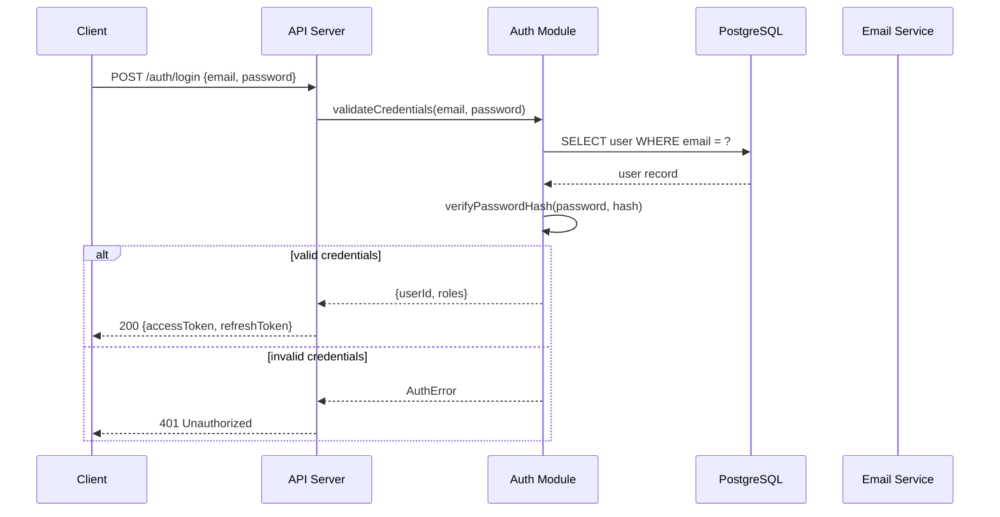

# /arch-sequence — sequence diagrams for critical flows

Sequence diagrams make implicit temporal dependencies explicit. They're most valuable for flows that cross component boundaries, involve async operations, or have failure modes that aren't obvious.

## Which flows deserve a sequence diagram

A flow deserves a sequence diagram if it:
- Crosses two or more components / services
- Has a non-trivial failure mode (partial failure, timeout, rollback)
- Involves async operations (queues, webhooks, scheduled jobs)
- Has been a source of bugs or confusion in similar systems

Do NOT diagram every flow — simple CRUD operations through a single component don't need one. Identify the 2-3 riskiest or most complex flows.

Common candidates:
- Authentication / session management (crosses auth + API + client)
- Payment processing (critical, multi-step, compliance-sensitive)
- Multi-step workflows with compensation (booking, order management)
- Webhook delivery and retry flows
- Any flow involving a third-party API with potential failure

## Output format

Mermaid sequence diagram:

Key syntax:
- `->>` synchronous call, `-->>` synchronous response
- `--)` async message (no wait), `--)`async response
- `alt` / `else` / `end` for conditional branches
- `loop` for retry or polling
- `Note over X,Y: text` for annotations

## Procedure

1. **Identify the 2-3 flows** most worth diagramming (complexity, failure risk, cross-component)
2. **List participants** — components from `/arch-components`, external actors
3. **Trace the happy path** — full request → processing → response
4. **Add failure branches** — at least one `alt` covering the primary failure mode
5. **Add async markers** where applicable
6. **Annotate** any step where the design decision isn't obvious

Accompany each diagram with: what it shows, what the critical failure modes are, and how the design handles them.

Recommend next step: `/arch-adr` to record the decisions made while drawing these flows.

## Anti-rationalization table
| Common Excuse | Why It's Wrong | What to Do Instead |
|---|---|---|
| "The happy path is all that matters" | The happy path never happens in production. Error paths and edge cases cause incidents. | Draw 3 sequence diagrams: happy path, error path, edge case. |
| "Sequence diagrams are too detailed for early design" | Sequence diagrams force you to think about ordering, which is where most bugs live. | Focus on the 2-3 most architecturally risky flows. Not every flow. |
| "I can visualize the flow without drawing it" | Visualization in your head has no shared language. The team can't discuss it. | Draw it in Mermaid. 10 minutes. Everyone can see and critique. |
