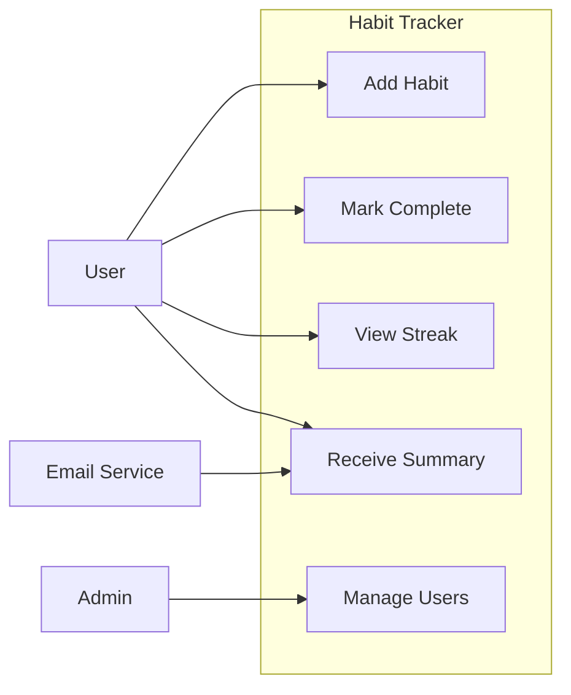

# /arch-use-cases — UML use case diagram

Defines who uses the system and what they can do with it. The use case diagram is the highest-level architectural view — it sets the system boundary before any internal decomposition begins.

## What a use case diagram shows
- **Actors** — who interacts with the system (human users, external systems, time-based triggers)
- **Use cases** — what the system can do (named as verb + noun: "Manage Habits", "Process Payment")
- **System boundary** — the box that separates inside from outside
- **Relationships** — which actors trigger which use cases; `<<include>>` for mandatory sub-flows; `<<extend>>` for optional ones

## Output format
Default: Mermaid diagram. Renders natively in GitHub READMEs, VS Code preview, Obsidian, Notion.

If the user needs formal UML, note that PlantUML syntax is available on request.

## Procedure

1. **Identify actors**: Who are the humans? What are the external systems? Any time-based triggers (scheduled jobs)?
2. **Identify use cases**: One per distinct user-facing capability from the user stories. Group by actor. Don't decompose into implementation steps — keep at business-capability level.
3. **Draw the boundary**: Everything inside the box is the system's responsibility. Everything outside is assumed to exist.
4. **Add relationships**: `<<include>>` for flows that always happen (authentication is included in every protected use case); `<<extend>>` for optional flows (email notification extends "Mark Complete").
5. **Produce Mermaid** and a brief plain-language key explaining each actor and use case.

Recommend next step: `/arch-components`.

## Anti-rationalization table
| Common Excuse | Why It's Wrong | What to Do Instead |
|---|---|---|
| "We know who our users are" | Known users are rarely all users. Missing actors cause missing features. | List every actor explicitly. Include systems, admins, background jobs. |
| "Use cases are just documentation" | Use cases define the system boundary. Without a boundary, scope creeps infinitely. | Draw the system boundary. Everything outside is not your problem. |
| "Actors are obvious from the domain" | Obvious actors are still worth documenting. The intern needs to see them too. | Write actor descriptions. Stakeholder → goal → interaction. |
